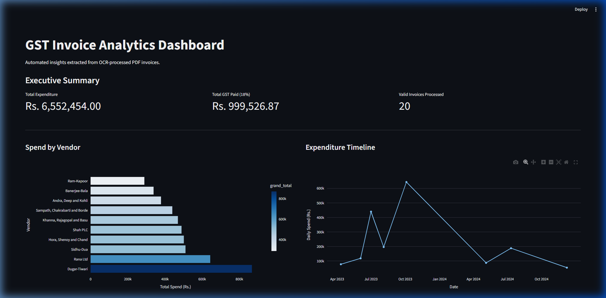

# 🧾 Invoice OCR & Analytics Pipeline

> End-to-end Python ETL pipeline that eliminates manual invoice data entry for Indian SMEs —  
> extracting structured financial data from raw PDF invoices, validating it, and loading it into  
> a queryable SQL database with a live analytics dashboard.


---

## 📸 Dashboard Preview



*Live dashboard showing total spend, GST paid, vendor breakdown, and expenditure timeline — generated from 20 OCR-processed PDF invoices.*

---

## 🎯 The Business Problem

Indian SMEs receive dozens of PDF invoices weekly and manually re-type every field —  
invoice number, vendor name, GST amount, grand total — into spreadsheets or accounting tools.  
This pipeline **automates that entirely**.

---

## ⚡ Quick Start

```bash
# 1. Clone the repo
git clone https://github.com/Yash-BP/invoice-ocr-pipeline.git
cd invoice-ocr-pipeline

# 2. Create virtual environment
python -m venv venv
.\venv\Scripts\activate

# 3. Install dependencies
pip install -r requirements.txt

# 4. Run the full pipeline (one command)
python run_pipeline.py

# 5. Launch the analytics dashboard
streamlit run dashboard.py
```

> Re-runs are fully safe — the pipeline is idempotent.

---

## 🏗️ Architecture

```
┌────────────────────── run_pipeline.py ──────────────────────┐
│               Orchestrator + timing + audit log             │
└──────┬─────────────────┬──────────────────┬─────────────────┘
       ▼                 ▼                  ▼
 generate_invoices   extract_ocr_data    load_to_database
       │                 │                     │
 20 realistic PDFs   OCR + Regex +      INSERT OR IGNORE
 (Faker + ReportLab)   Validation         into SQLite
```

---

## 📂 Project Structure

```
invoice-ocr-pipeline/
├── run_pipeline.py          # One-command orchestrator
├── dashboard.py             # Streamlit analytics dashboard
├── scripts/
│   ├── generate_invoices.py
│   ├── extract_ocr_data.py
│   ├── load_to_database.py
│   └── analyze_spending.py
├── tests/                   # Unit tests
├── data/
│   ├── extracted_invoices.csv
│   └── failed_invoices.csv
├── schema.sql
├── requirements.txt
├── .env.example
└── README.md
```

---

## 🔄 Pipeline Steps

| Step | Script                    | What it does |
|------|---------------------------|--------------|
| 1    | `generate_invoices.py`    | Creates 20 realistic Indian GST PDFs |
| 2    | `extract_ocr_data.py`     | Extracts data + validates totals |
| 3    | `load_to_database.py`     | Loads validated data into SQLite |

---

## 📊 Database Schema

```sql
CREATE TABLE processed_invoices (
    invoice_id        TEXT    NOT NULL UNIQUE,
    invoice_date      TEXT,
    vendor_name       TEXT,
    subtotal          REAL,
    tax_amount        REAL,
    grand_total       REAL,
    validation_passed INTEGER NOT NULL DEFAULT 1,
    validation_note   TEXT,
    source_file       TEXT,
    loaded_at         TEXT    NOT NULL DEFAULT (datetime('now'))
);
```

---

## 🧪 Running Tests

```bash
pytest tests/ -v
```

---

## ⚙️ Configuration (.env)

Copy `.env.example` → `.env` and edit if needed.

---

## 🛠️ Tech Stack

- **Language**: Python 3.13
- **PDF Parsing**: pdfplumber
- **PDF Generation**: ReportLab + Faker (en_IN)
- **Data Processing**: pandas
- **Database**: SQLite3
- **Dashboard**: Streamlit + Plotly
- **Testing**: pytest

---

## 💡 Why This Project Stands Out

- Solves a real business problem for Indian SMEs
- Built-in data validation (`validation_passed` column)
- Idempotent and safe to re-run
- Full observability with logging
- Live analytics dashboard
- Clean, modular, production-ready structure

---

Made with ❤️ by Yash Bhusari  
Portfolio Project | April 2026
```
